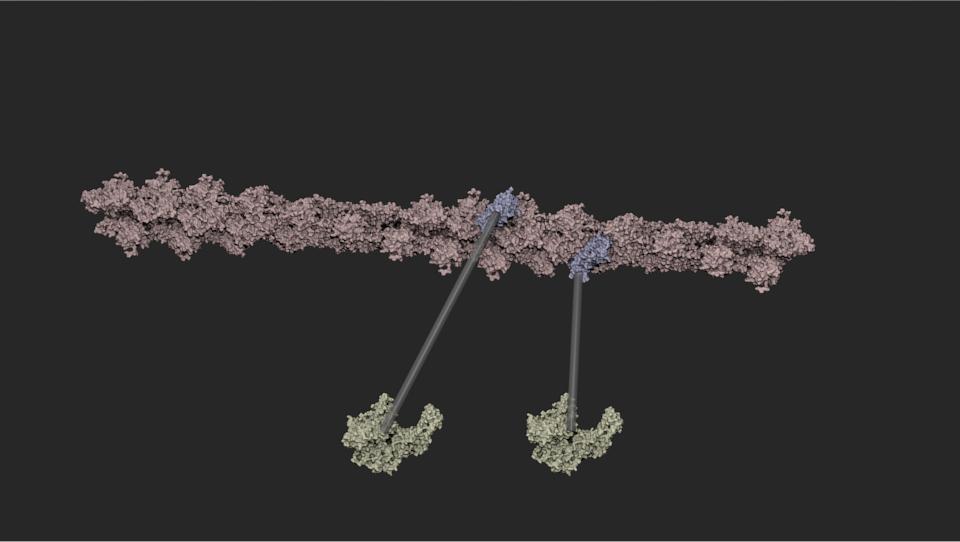

# sketchbio

Because of the difficulties involved in learning and using 3D modeling and rendering software, many scientists hire programmers or animators to create models and animations.
This both slows the discovery process and provides opportunities for miscommunication.
Working with multiple collaborators, a tool was developed (based on a set of design goals) to enable them to directly construct models and animations.

SketchBio is a tool that incorporates state-of-the-art bimanual interaction and drop shadows to enable rapid construction of molecular structures and animations.
It includes three novel features: crystal-by-example, pose-mode physics, and spring-based layout that accelerate operations common in the formation of molecular models.

For more inforamation, see the paper_tex_source directory.

